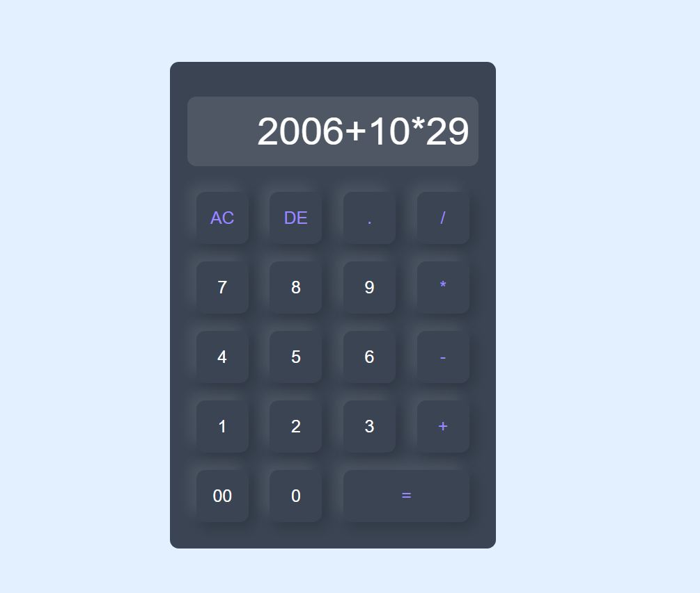

# JS Basic Calculator

A simple and responsive calculator web app created using **HTML**, **CSS**, and **JavaScript**.  
It performs basic arithmetic operations like addition, subtraction, multiplication, and division.

## 🚀 Features

- Clean and responsive UI  
- Handles basic arithmetic operations  
- Interactive button-based interface  
- Input validation and error handling  

## 📸 Preview

<details>
  <summary>Click For Image Preview</summary>

  <br>

  

</details>

## 🛠️ Technologies Used

- HTML5  
- CSS3  
- JavaScript (Vanilla)

## 📂 Folder Structure

```
📁 js-basic-calculator/
├── index.html (used JS as inline in html)
├── style.css
├── README.md
└── preview.png
```
## 🚀 How to Use

1. Clone or download this repository.
2. Open `index.html` in your browser.
3. Do the Math. (currently keyword input is disabled so use the clicks)


## 🔗 Live Demo

[JS_Calculator Live Demo](https://shaswatacharya.github.io/js-basic-calculator/)

---
Made with 💻 by [Shaswat Acharya](https://github.com/shaswatacharya)
